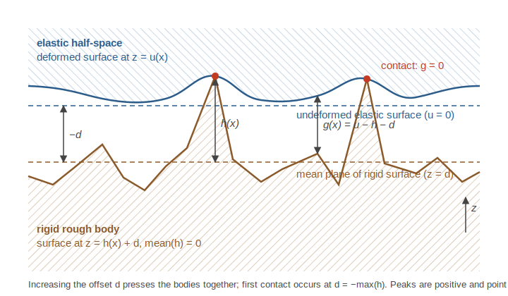

# Conventions used in contact mechanics calculations

This document describes the geometric conventions, sign conventions and
units used by the *Contact mechanics* analysis of
[contact.engineering](https://contact.engineering). All statements below
refer to the quantities stored in the per-step netCDF files
(`step-*/nc/results.nc`) contained in the ZIP download and to the values
shown in the web app.

## Heights

- Uploaded topography data are **heights**, not gaps: peaks are positive
  and point *out of* the material, towards the opposing body. If you
  measured the gap of a rigid contact, you need to invert the sign before
  uploading.
- The analysis works with **detrended** data: the mean height is
  subtracted before the calculation, i.e. the height profile *h* used
  below fulfills mean(*h*) = 0. (Depending on the detrending mode chosen
  for the measurement, a tilt may also have been removed.)

## The contact problem

The calculation solves frictionless, adhesionless normal contact of a
rigid rough surface with height profile *h(x, y)* against a flat elastic
half-space, using the boundary-element method with an FFT-based solver.
Roughness on both bodies can be handled by mapping the problem onto the
contact of a rigid rough body with the *composite* roughness against a
flat elastic body with the *composite* elastic modulus (see below).

The kinematic quantities are related by the gap equation

    g(x, y) = u(x, y) − h(x, y) − d ≥ 0

where

- *g* is the local **gap** between the two surfaces (`gap` in the netCDF
  files; negative values are clipped to zero),
- *u* is the normal **displacement** of the elastic surface
  (`displacement`),
- *h* is the (detrended) height profile of the rigid surface, and
- *d* is the **rigid body displacement** or *offset*
  (`mean_displacement` attribute).

## Sign of the rigid body displacement (offset)

The offset *d* is a *penetration-like* coordinate, **not** a separation:

- The surfaces touch first (at a single point, without deformation) when
  *d* = −max(*h*).
- **Increasing** *d* presses the bodies together and increases the
  contact area; gaps are large when *d* is very negative.
- Since mean(*h*) = 0, at *d* = 0 the rigid surface has (nominally)
  penetrated the elastic body down to its mean plane.

## In-plane coordinates: x and y

- **x is the first array index, y is the second array index** of the
  two-dimensional fields (`pressure`, `gap`, `displacement`,
  `contacting_points`) stored in the netCDF files. This matches the
  convention used for the topography data itself.
- Grid spacing is `physical_sizes[0] / nb_grid_pts[0]` in x and
  `physical_sizes[1] / nb_grid_pts[1]` in y.
- In the color-map images rendered by the web app, the fields are
  transposed for display: x runs horizontally (to the right) and y runs
  vertically (image row convention).

See [`examples/plot_contact_step.py`](examples/plot_contact_step.py) for
a self-contained script that reads a `results.nc` file and produces
correctly labeled plots.

## Definition of the contact modulus E*

All pressures are expressed in units of the **contact modulus**
(also called effective or composite modulus)

    1/E* = (1 − ν₁²)/E₁ + (1 − ν₂²)/E₂

where *E*₁, *E*₂ are the Young's moduli and ν₁, ν₂ the Poisson numbers of
the two contacting bodies. For a rigid indenter on an elastic body this
reduces to 1/E* = (1 − ν²)/E. Because the contact problem is linear
elastic and frictionless, the calculation itself is independent of the
value of E*; results can be converted to physical units by multiplying
with your value of E* (or by supplying `elastic_modulus` /
`elastic_modulus_unit` when triggering the analysis, in which case
pressure axes of the derived plots are rendered in physical units).

## Load-controlled calculations

When explicit pressure values are prescribed (`pressures` parameter), the
imposed quantity is the **nominal pressure**

    p = F / A₀

where *F* is the total normal force and *A₀* is the (projected) scan
area, i.e. the product of the physical sizes of the measurement. The
solver then finds the offset *d* that produces this total force. When the
number of steps (`nsteps`) is given instead, the calculation is
displacement controlled and offsets are chosen such that the resulting
contact areas are approximately equally spaced on a logarithmic scale.

Note that for **nonperiodic** (free boundary) calculations the nominal
pressure has no direct physical interpretation — the physically
meaningful control quantity is the total force *F* = *p* · *A₀*, reported
as `mean_forces` in the analysis result (in units of E*·unit²).

## Units

| Quantity | netCDF variable / attribute | Unit |
|----------|-----------------------------|------|
| Pressure field | `pressure` | E* |
| Gap field | `gap` | length unit of the measurement (`length_unit` attribute) |
| Displacement field | `displacement` | length unit of the measurement |
| Contacting points | `contacting_points` | dimensionless mask (1 = in contact) |
| Nominal pressure | `mean_pressure` attribute | E* |
| Rigid body displacement | `mean_displacement` attribute | length unit of the measurement |
| Contact area | `total_contact_area` attribute | fraction of the nominal (scan) area |
| Total force | `mean_forces` (analysis result) | E* · (length unit)² |
| Hardness | `hardness` attribute | E* |

The contact area map and patch size distributions are computed from the
active set of the constrained optimizer, i.e. the set of points where the
non-penetration constraint is active.

## Contact of two rough surfaces (composite roughness)

To compute the contact of two rough surfaces *h*₁ and *h*₂ (both
following the height convention above, peaks positive), run the
calculation on the **composite roughness**

    h = h₁ + h₂

together with the composite modulus E* defined above. Adding the two
height profiles (rather than subtracting) is correct because the peaks of
both surfaces point towards the opposing body. At present you need to add
the topographies yourself (e.g. in Python with
[SurfaceTopography](https://github.com/ContactEngineering/SurfaceTopography))
and upload the sum as a new measurement.
